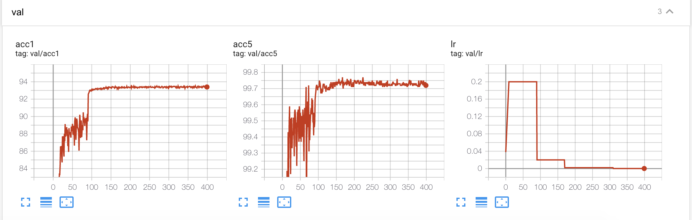

```bash
./run_cli.sh examples/classifier_cifar10/prototxt/model_val.prototxt
```

```
Inference for complexity summary
Computational complexity:       0.61 GMac
Number of parameters:           4.66 M  
Use step scheduler, step size: 20, gamma: 0.10000000149011612
Test: [ 0/40]	Time  1.446 ( 1.446)	Loss 2.1381e-01 (2.1381e-01)	Acc@1  92.19 ( 92.19)	Acc@5  99.61 ( 99.61)
 *Time 3s Acc@1 93.400 Acc@5 99.690
```

 ```bash
 ./run_cli.sh examples/classifier_cifar10/prototxt/vggsmall_baseline_single_gpu.prototxt
 ```

 

 ```bash
  ./run_cli.sh examples/classifier_cifar10/prototxt/vggsmall_baseline_multi_gpu.prototxt
 ```

  