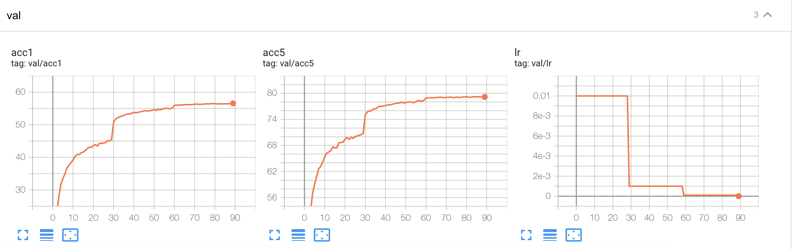
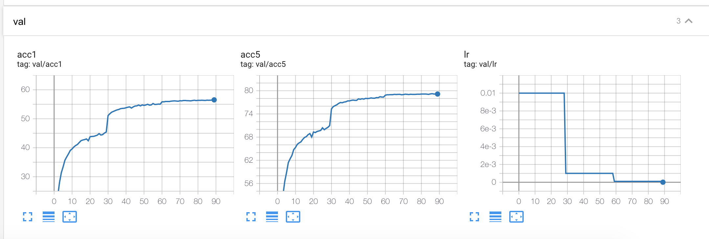

# ImageNet baseline


## train

[alexnet_single_gpu_2021-09-23-21:06.zip](https://github.com/hustzxd/eppb_zoo/blob/main/alexnet_single_gpu_2021-09-23-21:06.zip)
 ```bash
 ./run_cli.sh examples/classifier_imagenet/prototxt/alexnet_train_single_gpu.prototxt
 ```

 

[alexnet_multi_gpu_2021-09-23-21:09.zip](https://github.com/hustzxd/eppb_zoo/blob/main/alexnet_multi_gpu_2021-09-23-21:09.zip)
 ```bash
 ./run_cli.sh examples/classifier_imagenet/prototxt/alexnet_train_multi_gpu.prototxt 
 ```

  
