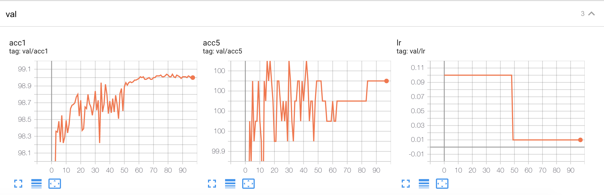

# Mnist Baseline

| Mnist | accuracy |
|-------|----------|
| LeNet | 99.23    |

```bash
./run_cli.sh examples/classifier_mnist/prototxt/model_val.prototxt
```

```
=> using pre-trained model 'mnist_lenet'
model:
=========

LeNet(
  (conv1): Conv2d(1, 6, kernel_size=(5, 5), stride=(1, 1))
  (conv2): Conv2d(6, 16, kernel_size=(5, 5), stride=(1, 1))
  (fc1): Linear(in_features=400, out_features=120, bias=True)
  (fc2): Linear(in_features=120, out_features=84, bias=True)
  (fc3): Linear(in_features=84, out_features=10, bias=True)
)
define optimizer
Use SGD
Inference for complexity summary
Computational complexity:       0.0 GMac
Number of parameters:           61.71 k 
Use step scheduler, step size: 20, gamma: 0.10000000149011612
Test: [ 0/40]	Time  0.063 ( 0.063)	Loss 1.7307e-02 (1.7307e-02)	Acc@1  99.61 ( 99.61)	Acc@5 100.00 (100.00)
 *Time 2s Acc@1 99.230 Acc@5 99.980
```


## [train](https://github.com/hustzxd/eppb_zoo/blob/main/mnist_lenet_baseline_2021-09-23-20:40.zip)
```bash
./run_cli.sh examples/classifier_mnist/prototxt/mnist_lenet_train.prototxt
```


